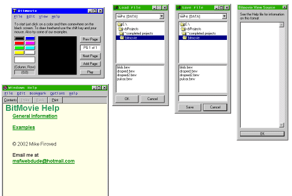



## BitMovie Animation Creator

### Description

To make animations like cartoonists do, page at a time. To demonstate how to save files and load files. To demonstrate how to save data in text format.
 
### More Info
 

             |
---                |---
**Submitted On**   |2002-03-01 16:44:34
**By**             |[Mike Firoved](https://github.com/Planet-Source-Code/PSCIndex/blob/master/ByAuthor/mike-firoved.md)
**Level**          |Advanced
**User Rating**    |4.8 (29 globes from 6 users)
**Compatibility**  |VB 6\.0
**Category**       |[Graphics](https://github.com/Planet-Source-Code/PSCIndex/blob/master/ByCategory/graphics__1-46.md)
**World**          |[Visual Basic](https://github.com/Planet-Source-Code/PSCIndex/blob/master/ByWorld/visual-basic.md)
**Archive File**   |[BitMovie\_A58718312002\.zip](https://github.com/Planet-Source-Code/mike-firoved-bitmovie-animation-creator__1-32245/archive/master.zip)

